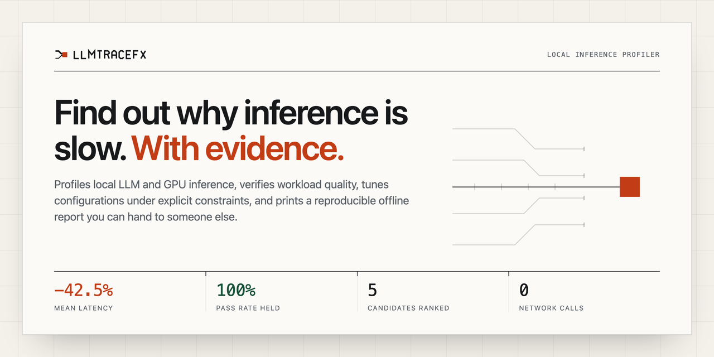

<p align="center">
  <picture>
    <source media="(prefers-color-scheme: dark)" srcset="assets/brand/llmtracefx-lockup-inverse.svg">
    
  </picture>
</p>

<p align="center">
  <strong>Measure what happened. Verify that it was correct. Optimize only what the evidence supports.</strong>
</p>

<p align="center">
  <a href="#quickstart">Quickstart</a>
  ·
  <a href="#current-capabilities">Capabilities</a>
  ·
  <a href="SELF_HOST_GLM_RUNBOOK.md">Modal runbook</a>
  ·
  <a href="https://siddhantkhare.com/writing/ttft-http-client">Methods example</a>
  ·
  <a href="DESIGN.md">Design system</a>
</p>

<p align="center">
  
</p>

<p align="center"><sub>The report values in this preview are synthetic interface examples, not benchmark results.</sub></p>

LLMTraceFX is an evidence-first inference toolkit for local models and
OpenAI-compatible streaming APIs. It collects measurements into one canonical
schema, checks model output with deterministic workloads, and recommends a
configuration only when it satisfies an explicit policy.

The main workflow is:

1. **Measure** with a collector or import an existing runtime artifact.
2. **Verify** the response against a pinned workload and retain failed or
   incomplete evidence.
3. **Compare and tune** candidates under one objective and stated constraints.
4. **Optimize** only after the collected evidence supports a recommendation.

## Quickstart

The LLMTraceFX commands in this path use no API key, model download, network
request, or accelerator. Cloning the repository and installing uncached
dependencies can use the network. The commands then audit the environment,
materialize a deterministic workload plan, and write an inspectable API request
plan.

```bash
git clone https://github.com/Siddhant-K-code/LLMTraceFX.git
cd LLMTraceFX
uv sync --locked

mkdir -p output/quickstart

uv run llmtracefx-optimizer manifest \
  --output output/quickstart/environment.json

uv run llmtracefx-optimizer workloads generate-matrix \
  --model-id example/local-model \
  --model-family qwen3_next \
  --context-tiers 2k \
  --max-tokens 16 \
  --output-dir output/quickstart/matrix

env -u LLMTRACEFX_QUICKSTART_NO_KEY uv run llmtracefx-optimizer collect-api \
  --run-id api-plan \
  --provider example \
  --endpoint https://example.com/v1/chat/completions \
  --model-id example-model \
  --prompt-file examples/optimizer/api-smoke-prompt.txt \
  --output-dir output/quickstart/api-plan \
  --api-key-env LLMTRACEFX_QUICKSTART_NO_KEY \
  --dry-run
```

The last command writes `output/quickstart/api-plan/request_plan.json`. Its
`network_request_performed` field is `false`, and the dry run does not read an
API credential because the named variable is explicitly unset. In general, a
dry run does not require or transmit a credential. If its named variable is
already set, it reads the value only to detect unsafe embedding and redact the
plan.

Two more offline commands describe the optional Modal deployment harness:

```bash
uv run llmtracefx-deploy recipe
uv run llmtracefx-deploy budget --credit-usd 30
```

Neither command imports Modal, authenticates, creates resources, or performs a
network request.

## Current capabilities

### Canonical evidence

Inference collectors and the llama.cpp importer produce `ExperimentRecord`
schema version 1. Instruments collection writes a separate, typed evidence
record for trace capabilities and supported Metal tables. Numeric measurements
carry a unit and a provenance:

- `measured_native`
- `measured_wall_clock`
- `provider_reported`
- `derived`
- `estimated`

Unavailable observations remain absent. They are not converted to zeros or
relabelled as measurements.

### Collection

- **MLX and MLX-LM:** run an existing local model directory on Apple silicon
  and record normalized timing and memory evidence. LLMTraceFX does not
  download the model.
- **OpenAI-compatible streaming APIs:** record client-observed headers,
  first-byte timing, first visible content, inter-event timing, completion
  state, and provider-reported usage without persisting the credential.
- **llama.cpp:** convert captured stdout and stderr into the canonical evidence
  schema. This parser does not launch or configure llama.cpp.
- **Apple Instruments:** check `xctrace` capability, print an execution plan,
  record a local command, or import an existing trace bundle. Supported Metal
  tables are reported narrowly rather than treated as generic GPU utilization.
- **Native Qwen MTP:** emit a capability report and an explicit unsupported
  record when the installed stack cannot produce trustworthy native-MTP
  evidence.

### Verification and resumability

The workload catalog covers code completion, structured JSON, and prose
reasoning across pinned context tiers. `workloads generate-matrix` writes the
prompts, hashes, runner configs, and planned commands without loading a model.

`workloads run` and `workloads run-api` verify that the prompt, workload
version, run binding, and artifact hashes still match. A complete hash-matching
run is resumed by default. Failed, partial, mismatched, and unsupported rows
remain visible instead of being scored as successes.

### Controlled vLLM crossover protocol

`llmtracefx-vllm-crossover plan` renders the preregistered Qwen3-8B vLLM
compilation crossover offline. It defines separate fixed-token-count and
natural-output lanes, eight fresh eager/compiled lifecycle pairs per lane,
counterbalanced order, whole-pair uncertainty, and a strict list-rate budget.

```bash
uv run --offline --no-sync llmtracefx-vllm-crossover plan
make vllm-crossover-verify
```

These commands do not authenticate, contact CloudRift or Modal, download a
model, use a GPU, or authorize spend. The controlled lane fixes decode-step
count, not output identity; unequal output token arrays are never described as
output-controlled. A paid `run` requires a separate exact-plan authorization
receipt and controls Docker only on an already provisioned local host. It
contains no provider or SSH client. Any temporary public-key access is managed
out of band; passwords, private keys, API tokens, host addresses, usernames,
ports, and provider credentials are not accepted. Authorization is
content-hashed, bound to the exact resolved workspace, and authenticated with
an OpenSSH detached signature against an operator-managed authorized-signers
file. It also binds the pinned image, billing start, zero-retry rule, and
external shutdown deadline. Every Docker command targets only
`unix:///var/run/docker.sock`; Docker/SSH routing environment variables are
rejected and host subprocesses receive a fixed minimal environment.

Only a fully completed 32-cell workspace can be published with
`llmtracefx-vllm-crossover-results build --workspace ... --output ...`. The
builder revalidates lifecycle, hardware, prompt, output, correctness, budget,
and teardown evidence; it resamples whole lifecycle pairs and preserves
unobservable request/compile fields as explicit nulls.
Serving cumulative time is model initialization plus measured request
durations; inter-request progress-receipt I/O is excluded and remains visible
only in host lifecycle time. A natural-lane causal-speedup claim additionally
requires correct, identical, reproducible outputs and a whole-pair timing
interval whose upper endpoint is nonpositive. Identical lifecycle-pair quality
effects are reported as deterministic observed agreement, not as a zero-width
confidence interval.
All bootstrap procedures use only eight independent lifecycle pairs and may
under-cover; controlled crossover support additionally requires the exhaustive
sign-symmetry permutation gate, while natural timing and nondegenerate quality
intervals have no such backstop.

### Modal L4 crossover protocol delta

`llmtracefx-modal-l4-crossover plan` renders a separate protocol identity,
`qwen3-8b-vllm-crossover-modal-l4-v1`, for one future Modal L4 execution of the
same sealed experiment. The scientific core is unchanged: the same pinned model
revision and runtime pins, two lanes, eight adjacent eager/compiled pairs per
lane, the same 32-cell counterbalanced schedule, 144 fixed-token-count
controlled requests and 12 natural requests per cell, whole-pair statistics
reusing the existing results core, and no extrapolation.

```bash
uv run --offline --no-sync llmtracefx-modal-l4-crossover plan
make modal-l4-crossover-bundle modal-l4-crossover-verify
```

Neither command imports the Modal SDK, authenticates, creates a container,
downloads a model, uses a GPU, or authorizes spend. Work would run through
Modal Functions and RPC only, never a public web endpoint, on one L4 with four
physical CPU cores and 32 GiB, one live cell, `max_containers=1`,
`min_containers=0`, single-input concurrency, single-use cell containers, zero
retries, and an explicit timeout per stage. Any observed second attempt, crash,
preemption, timeout, or missing terminal receipt invalidates the run and
triggers teardown.

The priced envelope is 15,240 container seconds ($4.5985056) plus a $0.48
volume reservation covering one active and four post-delete days, totalling
$5.0785056 against a $6 hard cap; the $0.9214944 contingency is never spent on
science. The application ledger is mandatory and is explicitly not provider
proof: provider-reported spend stays null until an external sanitized receipt
exists. Before execution the official rates are re-fetched and hashed, and the
run is refused if any official rate is higher or a new charge appears.
Authentication uses only the operator's standard local Modal profile;
`MODAL_TOKEN_ID`, `MODAL_TOKEN_SECRET`, profile, config, server, environment,
and routing overrides plus credential-shaped variables are rejected by name and
never read.

A fail-closed GPU memory gate precedes the measured cells. Runner arguments
stay BF16, tensor parallel 1, one sequence, 0.94 utilization, no prefix or
speculative decoding, and a context length of exactly the longest frozen prompt
array plus 96. CPU staging verifies 15 files and 16,397,461,266 bytes and seals
the token arrays; isolated eager and compiled canaries then run the actual
longest controlled prompt for 96 steps and must observe exactly one L4, the
pinned runtime, sufficient KV capacity, no OOM, a full terminal completion, and
a peak at least 512 MiB below total VRAM. Nothing is tuned to make the gate
pass; a failure publishes a refusal.

Modal exposes no host page-cache drop and no dedicated-host reservation, so
those CloudRift requirements are removed from this protocol only. Fresh
single-use containers, unique writable cache directories, a disabled compile
cache, a read-only shared model volume, and zero hidden warmups remain
observable; provider placement, physical host reuse and page-cache state, and
volume/backend caching do not. Results are therefore descriptive,
provider-conditioned paired comparisons: pure causal compilation and natural
causal speedup claims are unsupported by construction.

#### Execution surface

`llmtracefx.optimizer.lab.qwen3_8b.modal_l4_app` is the only module in the
package that imports the Modal SDK. It declares authenticated internal
Functions over RPC and no web endpoint: a CPU staging Function on a slim image
pinned to `huggingface_hub==1.29.0`, a CPU verification Function on the
digest-pinned runtime image that checks 15 files and 16,397,461,266 bytes and
seals the prompt token arrays, two L4 canary Functions, two L4 cell Functions,
and a CPU analysis Function. Every Function is declared from the sealed plan
with four cores, 32 GiB, its own explicit timeout, `retries=0`,
`max_containers=1`, `min_containers=0`, `buffer_containers=0`, `max_inputs=1`,
`single_use_containers=True`, and one input at a time. CPU Functions carry no
accelerator argument at all, accelerated Functions mount the run-scoped model
volume read-only, and no `modal.Secret` is created or read anywhere.

Measurement is not reimplemented. The cell Function calls the existing
CloudRift crossover cell runner, so the deterministic environment, the memory
sampler, the frozen `_llm_kwargs`, the request records, and the terminal-shape
checks are the same code. The one deliberate difference is the hardware gate:
the CloudRift gate admits one exact RTX 4090, so this delta has an L4 gate that
pins the accelerator name and count and records the provider-managed driver
instead of pinning it.

`llmtracefx-modal-l4-execute preflight` runs every gate and stops before the
SDK is imported: environment overrides are rejected by name without reading a
value, the authorization is verified against an OpenSSH detached signature and
bound to the exact plan hash, source head, nonce, run-scoped names, image
reference, workspace path, and rate-receipt hash, the official rate documents
are re-fetched and hashed (never parsed for numbers), and account headroom
comes from a sanitized control-plane probe or a separately signed operator
receipt — never from silence. `run` then imports the SDK, probes it against the
pinned and inspected modal 1.5.5 API surface, and executes staging,
verification, the eager canary, the compiled canary, the 32 sealed cells only
if both canaries pass, and the analysis inventory, sequentially, reserving each
lifecycle in the ledger before every call. A second attempt, crash, preemption,
timeout, or missing terminal receipt stops the run where it stands, with no
replacement cells.

Teardown runs in a `finally` on every path: the outstanding call is retained
until it is cancelled with container termination, the ephemeral app context
exits (a local action, never claimed as provider deletion proof), function
autoscaler stats are read as scale-to-zero evidence, the run-scoped volume is
deleted, and the volume listing — the only named-resource inventory Modal
exposes — is read back into a sanitized receipt. Modal exposes no per-container
delete, no `App.stop()`, and no app or container inventory, so none is claimed;
each is published as an explicit unsupported control, as is the absence of a
pre-run spend authority, and any ambiguity (a listing that could not be
performed) fails the teardown closed. A complete run whose teardown is
incomplete is a refusal, not a result.

The completed run is validated and analyzed by a provider-native results path
(`modal_l4_crossover_results.analyze_modal_run`): it consumes the orchestration
receipt and the 32 sealed inner cell receipts, checks schedule, lane, mode and
pair coverage, one attempt per lifecycle, L4/runtime-pin/driver and nonce-bound
commitment continuity from both canaries through every cell, per-cell cache
scope, teardown and budget, and then reuses the CloudRift results core's
provider-neutral statistical primitives over the inner receipts. It never
imports the CloudRift-bound public builder, never fabricates a CloudRift
authorization or host-cache receipt, and never claims host-cache or causal
control: those claims stay unsupported by construction, while the
fixed-token-count, provider-conditioned paired result is eligible only when
every gate passes.

#### Credential exposure gate

A standard-profile credential was exposed outside this system. Provider
execution is blocked until a coordinator attests, in a closed booleans-only
schema, that the exposed credential was revoked and that a fresh
standard-profile credential was created locally and never shared. The gate runs
first in `preflight`, before the environment check, before authorization
verification, and before the SDK can be imported; an absent or malformed
attestation is a refusal, never an assumption of clearance.

The attestation and every stored verdict record status only —
`exposed_profile_credential_never_used_by_experiment`,
`exposed_profile_credential_revocation_confirmed`,
`fresh_local_profile_created_without_sharing`,
`fresh_profile_shared_anywhere`, a confirmer name, a timestamp, and a short
reason. Fields whose names look like a token, a secret, a hash, a prefix, a
fingerprint, an account, or screenshot metadata are refused by name, extra
fields outside the allowlist are refused, and a reason that looks
credential-shaped is refused without being stored. No credential value, hash,
prefix, or derived identifier is ever read or written by this code. The
authorization receipt binds the hash of that booleans-only attestation
document, so a cleared gate cannot be swapped for another after signing, and a
completed result bundle is refused unless its gate verdict is cleared.

### Tune within one target

`tune` reads existing `verification.json` and `final_record.json` files. It
does not load a model or execute a benchmark. A policy chooses one objective
and can constrain pass rate, quality metric, peak memory, latency, provenance,
repetition count, and coefficient of variation.

```bash
uv run llmtracefx-optimizer tune \
  --results output/results \
  --policy examples/optimizer/tune-policy-fastest-under-20gb-m5-pro.json \
  --output output/tune-report.json \
  --explain

uv run llmtracefx-optimizer tune-report \
  --input output/tune-report.json \
  --output output/tune-report.html
```

The HTML report is a deterministic, self-contained view with inline CSS, no
JavaScript, and no CDN. Local paths are redacted unless `--include-paths` is
set.

### Cross-system comparison

`tune` compares configurations within one model and hardware target. `compare`
works across already-collected local and hosted systems. It is offline: it
loads no model, calls no API, deploys nothing, and runs no benchmark.

The command accepts only result directories shaped by `workloads run` or
`workloads run-api`: each row must have `verification.json` and the referenced
`final_record.json`. API rows also validate the collector's
`api_evidence.json` and completion marker. Flat `collect-api` output is not
accepted because it has no workload verification or quality result.

Use separate result directories for repetitions. Reusing one directory resumes
the completed row instead of measuring it again. Pass every repetition to
`--results`; duplicate paths count once.

```bash
uv run llmtracefx-optimizer compare \
  --results \
    artifacts/local/rep-1 artifacts/local/rep-2 \
    artifacts/frontier-api/rep-1 artifacts/frontier-api/rep-2 \
    artifacts/flash-api/rep-1 artifacts/flash-api/rep-2 \
  --policy examples/optimizer/compare-policy-local-vs-api-latency.json \
  --output artifacts/cross-system-compare.json \
  --explain

uv run llmtracefx-optimizer compare-report \
  --input artifacts/cross-system-compare.json \
  --output artifacts/cross-system-compare.html
```

Systems are compared only within a comparable stratum: identical workload and
version, prompt hash, context tier, evaluator, output cap, sampling, and request
shape. Different or unknown settings remain separate. System identity retains
model and revision, provider, runtime and backend, accelerator, quantization,
reasoning settings, endpoint route, decode mode, and collection configuration.

The report can carry pass rate, quality, total latency, client or local
first-token timing, correct cases per minute, provider-reported usage, and
estimated cost metrics where those values exist. It does not:

- rank local prefill timing against hosted client-observed time to first visible
  content;
- invent hosted peak memory or replace missing evidence with zero;
- combine objectives into a blended score;
- choose a winner when the evidence is tied, within noise, or limited to one
  system.

Cost objectives require `--pricing` with a versioned manifest. No rates are
built in or fetched. Every monetary result is estimated from provider-reported
usage and the supplied rate entry. The file
`examples/optimizer/pricing-manifest-illustrative.json` contains invented
demonstration values and must not be used as a current price list.

`compare-report` renders a deterministic, self-contained HTML file. Paths and
endpoint hosts are redacted by default; `--include-paths` is explicit opt-in.
Prompt text, response text, reasoning content, and credentials are not fields
in the comparison schema.

See the synthetic, non-benchmark
`examples/optimizer/compare-report-example.json` and the example policies
`compare-policy-local-vs-api-latency.json` and
`compare-policy-cost-per-correct-case.json`.

### Optimize an approved path

`optimize` composes matrix execution, tuning, and optional HTML rendering. Its
`--dry-run` path lists selected rows, blockers, and expected artifacts without
loading a model or tuning:

```bash
uv run llmtracefx-optimizer optimize \
  --matrix output/quickstart/matrix/manifest.json \
  --model-path /existing/local/mlx/model \
  --results output/results \
  --policy examples/optimizer/tune-policy-fastest-under-20gb-m5-pro.json \
  --dry-run
```

## Prerequisites by path

| Path | Requirements | Install or check |
| --- | --- | --- |
| Offline planning and report inspection | Python 3.10+ and `uv` | `uv sync --locked` |
| Local MLX collection | macOS on arm64, MLX, MLX-LM, and an existing local model directory | `uv sync --locked --extra mlx` |
| Metal and `xctrace` | macOS, full Xcode command-line tools, and a locally available Instruments template | `uv run llmtracefx-optimizer instruments capability` |
| Hosted API collection | An HTTPS OpenAI-compatible endpoint and a provider key stored in an environment variable | Use `collect-api --dry-run` before making a request |
| Modal planning | No Modal account or SDK is required | `uv run llmtracefx-deploy plan --help` |
| Modal execution | An approved plan, current price inputs, Modal account and auth, optional `modal` extra, proxy auth token, pinned model revision, and pinned serving image | `uv sync --locked --extra modal` |
| Modal L4 crossover execution | A signed authorization, cleared credential-exposure attestation, fresh rate receipt, and signed headroom, plus the exactly pinned SDK | `uv sync --locked --extra modal-l4-execute` (installs `modal==1.5.5`) |

Hosted API requests, Modal staging, deployment, health checks, and inference can
incur provider charges. None runs from the quickstart or from
`llmtracefx-deploy recipe`, `budget`, or `plan`.

## Measure

### Local MLX

```bash
uv run llmtracefx-optimizer collect-mlx \
  --run-id local-baseline \
  --model-path /existing/local/mlx/model \
  --model-id organization/model \
  --model-revision <pinned-revision> \
  --prompt-file examples/optimizer/mlx-smoke-prompt.txt \
  --output-dir output/local-baseline \
  --max-tokens 64 \
  --seed 0
```

The model path must already exist. Generic external draft-model speculation is
available through `--draft-model-path`; it is labelled `draft-model`, not
native MTP.

### OpenAI-compatible API

Start with `--dry-run`. For a real request, load the key without putting it in
the command line or shell history, then remove `--dry-run`. This Bash example
uses a silent prompt:

```bash
read -rsp "Provider API key: " PROVIDER_API_KEY
printf "\n"
export PROVIDER_API_KEY

uv run llmtracefx-optimizer collect-api \
  --run-id hosted-baseline \
  --provider provider-name \
  --endpoint https://provider.example/v1/chat/completions \
  --model-id provider-model-id \
  --prompt-file examples/optimizer/api-smoke-prompt.txt \
  --output-dir output/hosted-baseline \
  --api-key-env PROVIDER_API_KEY \
  --max-output-tokens 64

unset PROVIDER_API_KEY
```

The key value is accepted only through the named environment variable. A
credential manager or shell integration is preferable for repeated use. Check
the provider's current prices and data-handling terms before sending a request.

The article
[What your TTFT benchmark is really measuring](https://siddhantkhare.com/writing/ttft-http-client)
is a practical methods example. It explains why client buffering, empty SSE
events, hidden reasoning, and truncated streams change what a time-to-first-
token number means.

### Apple Instruments and Metal

Check support before recording:

```bash
uv run llmtracefx-optimizer instruments capability

uv run llmtracefx-optimizer instruments plan \
  --output-trace output/metal.trace \
  --output-dir output/metal \
  --time-limit 30s \
  -- /path/to/local-command --its-argument
```

`plan` prints the exact `xctrace` invocation and runs no target command. The
recording path uses `record` in place of `plan`. Current parsing supports the
`metal-gpu-intervals` table and reports interval counts, duration sums, and
wall spans. It does not infer GPU utilization, occupancy, bandwidth, power, or
energy from those intervals.

A public, reproducible Apple Silicon example with a deterministic Metal
workload, sanitized measured evidence, integrity hashes, and charts lives in
[`examples/metal_evidence/`](examples/metal_evidence/README.md). Raw trace
bundles and XML exports are excluded by design.

## Verify, tune, and optimize

Generate a matrix for an existing model:

```bash
uv run llmtracefx-optimizer workloads generate-matrix \
  --model-id organization/model \
  --model-family qwen3_next \
  --target-model-path /existing/local/mlx/model \
  --output-dir output/matrix
```

Inspect execution without loading the model:

```bash
uv run llmtracefx-optimizer workloads run \
  --matrix output/matrix/manifest.json \
  --model-path /existing/local/mlx/model \
  --output-dir output/results \
  --mode autoregressive \
  --dry-run
```

Remove `--dry-run` to execute the selected MLX rows. Re-running the same command
resumes complete hash-matching rows. Pass `--no-resume` only when a deliberate
rerun is required.

For a hosted API, use `workloads run-api`. Its `--dry-run` validates selection,
endpoint configuration, and credential handling without a request:

```bash
uv run llmtracefx-optimizer workloads run-api \
  --matrix output/matrix/manifest.json \
  --output-dir output/api-results \
  --provider provider-name \
  --endpoint https://provider.example/v1/chat/completions \
  --model-id provider-model-id \
  --api-key-env PROVIDER_API_KEY \
  --mode autoregressive \
  --dry-run
```

Then run `tune`, `tune-report`, or `optimize` against the verified result
directory. The example policy files under `examples/optimizer/` are labelled
examples and contain no benchmark claim.

## Modal deployment

`llmtracefx-deploy` is a planning CLI for the pinned GLM-5.3-Flash harness. It
prints model facts, recommends a session cap from an operator-supplied credit
balance, and evaluates a proposed deployment from operator-supplied prices and
limits.

The planner is no-spend by construction. It does not deploy, authenticate,
open a socket, import Modal, download weights, call an API, or allocate an
accelerator. If required inputs or safety gates fail, it withholds paid
commands from its executable set.

Its calculated cost envelope is planning arithmetic, not a Modal billing
guarantee. Provider scheduling, billing granularity, traffic that reaches the
deployment, price changes, failed starts, and resources outside the declared
inputs can still affect the bill. Follow the full
[Modal GLM-5.3-Flash runbook](SELF_HOST_GLM_RUNBOOK.md), review every generated
command, and tear down the app and volume explicitly.

The older public Modal analyzer endpoint is retired and is not part of the
current quickstart.

## Command index

The console scripts below come from `pyproject.toml`.

| Command | Status | Purpose |
| --- | --- | --- |
| `llmtracefx-optimizer` | Current | Evidence collection, deterministic workloads, verification, comparison, tuning, and optimization |
| `llmtracefx-deploy` | Current | No-spend planning for the optional Modal GLM-5.3-Flash harness |
| `llmtracefx` | Legacy compatibility | Earlier token trace analyzer |
| `llmtracefx-serve` | Legacy compatibility | Local FastAPI surface for the earlier analyzer |
| `llmtracefx-dashboard` | Legacy compatibility | Earlier Streamlit dashboard; not the current evidence workflow |

Use `uv run llmtracefx-optimizer --help` and
`uv run llmtracefx-deploy --help` as the source of truth for current flags.
The legacy scripts are listed for package inventory only. Do not assume they
implement a side-effect-free `--help` path.

## Current status and limitations

- The repository contains synthetic fixtures and interface examples, but no
  real model benchmark result that should be treated as a performance claim.
- MLX collection requires Apple silicon and an existing local model. There is
  no direct CUDA collector; NVIDIA llama.cpp evidence is imported from captured
  output.
- API timing is observed at the client. It cannot expose provider queueing,
  prefill, kernel execution, or server-side clocks.
- Native Qwen MTP execution is not supported by the current MLX-LM path.
  LLMTraceFX records that limitation instead of substituting generic
  draft-model speculation.
- Instruments table availability varies by macOS, Xcode, hardware, and
  template. Unsupported schemas remain unsupported.
- Tuning is only as sound as the supplied workload, repetitions, provenance,
  and policy. An `inconclusive` outcome is expected when evidence is missing,
  noisy, tied, or fails every constraint.
- Modal planning reduces accidental spend but does not impose a provider-side
  account budget or guarantee a final bill.
- The legacy analyzer, local API, and dashboard remain in the package for
  compatibility. Their synthetic GPU scoring and optional explanation path are
  not the recommended optimizer workflow.
- The legacy `deploy-modal`, `serve-modal`, and `test-modal` Make targets operate
  on the earlier analyzer and can create billable Modal resources. They are not
  part of the budget-guarded GLM harness.

## Development

```bash
uv sync --locked --extra dev --extra test
uv run pytest
make lint-changed
```

The project supports Python 3.10 through 3.13. The `mlx` extra is installed
only on macOS arm64, and the `modal` extra is optional.

## License

[Apache-2.0](LICENSE)
