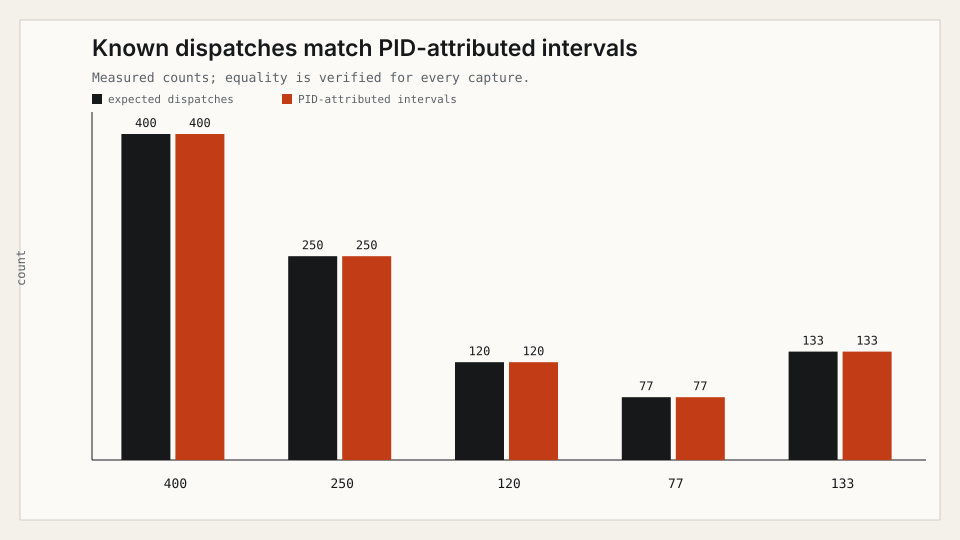
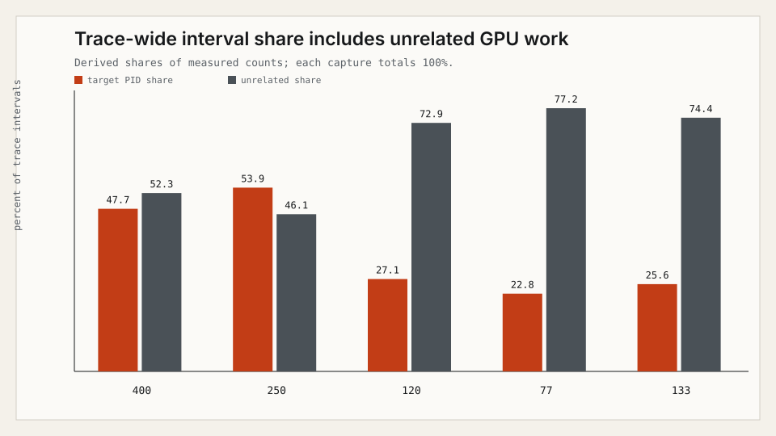

# Metal System Trace evidence

This bundle demonstrates one narrow claim: a trace-wide Metal GPU interval
count is not a workload count. Metal System Trace records other processes too,
so LLMTraceFX attributes the supported `metal-gpu-intervals` rows to the target
PID identified by the trace table of contents.

The committed JSON, CSV, and SVG files are derived evidence. Raw `.trace`
bundles and raw XML exports are deliberately excluded because they can contain
device names, hardware UUIDs, process labels, command arguments, user names,
and local paths.

## Reproduce

Requirements: Apple Silicon, full Xcode, the `Metal System Trace` template, and
the repository's locked Python environment.

```bash
uv sync --locked --extra dev --extra test
uv run python examples/metal_evidence/evidence_demo.py capability
make metal-evidence OUTPUT_DIR=/tmp/llmtracefx-metal-evidence
uv run python examples/metal_evidence/evidence_demo.py verify \
  --public-dir /tmp/llmtracefx-metal-evidence/public
```

`OUTPUT_DIR` is required and must be absent or empty. This prevents files from
different captures being mixed. The default run compiles
`metal_workload.swift`, records five bounded captures with known dispatch
counts (`400`, `250`, `120`, `77`, and `133`), imports each trace through the
existing strict parser, writes the public bundle, verifies it, and deletes raw
traces/XML. Pass `--retain-private` directly to the Python command only for
local diagnosis; never commit or publish that private directory.

Expected terminal shape:

```text
capability=supported
template=Metal System Trace
xctrace=xctrace version ...
capture_import=completed
dispatches=400 attributed=400 ... match=True
...
verification=passed
```

## Public files

- `experiment-manifest.json` records the exact safe environment, capture
  boundary, workload source hash, commands, and claim allowlists.
- `capture-summary.json` and `capture-summary.csv` contain only derived,
  process-scoped counts and explicitly labelled arithmetic.
- `dispatch-attribution.svg` compares known dispatches with measured,
  PID-attributed intervals.
- `unrelated-interval-share.svg` contrasts target-PID intervals with the
  derived known-unrelated count and the explicitly measured unattributed count.
- `SHA256SUMS` covers every generated public evidence file.

## Verified capture

The committed capture was recorded on 2026-08-31. Every run advertised 82
schemas and exported an 18-column `metal-gpu-intervals` table.

| Dispatches | PID-attributed | All processes | Known unrelated | Share | Unattributed | WindowServer | Share | Cells | References |
| ---: | ---: | ---: | ---: | ---: | ---: | ---: | ---: | ---: | ---: |
| 400 | 400 | 726 | 326 | 44.9% | 0 | 199 | 27.4% | 13,068 | 7,585 |
| 250 | 250 | 394 | 144 | 36.5% | 0 | 108 | 27.4% | 7,092 | 4,035 |
| 120 | 120 | 230 | 110 | 47.8% | 0 | 84 | 36.5% | 4,140 | 2,384 |
| 77 | 77 | 181 | 104 | 57.5% | 0 | 78 | 43.1% | 3,258 | 1,884 |
| 133 | 133 | 253 | 120 | 47.4% | 0 | 90 | 35.6% | 4,554 | 2,630 |

The target count matched the known dispatch count in all five captures.
Known-unrelated share is the derived ratio
`known_unrelated_interval_count / all_process_interval_count`, rounded to one
decimal place. Known-unrelated count excludes any row without a parseable PID;
this capture had zero such rows. `WindowServer` is reported as an aggregate
count and derived share for that standard macOS service; no other unrelated
process labels are retained. `capture-summary.json` distinguishes controlled
workload inputs, native measurements, and derived arithmetic for every field.





## Interpretation limits

Interval counts are event counts, not time or utilization. The unrelated share
is derived arithmetic over measured interval counts. The parser also measures
interval duration sums and wall spans, but this example intentionally omits
them to keep the claim focused. It makes no claim about GPU utilization, GPU
busy percentage, kernel time, memory bandwidth, occupancy, GPU power, GPU
energy, or GPU memory footprint. Results are specific to the recorded host,
toolchain, foreground activity, and capture boundary; unrelated-process counts
can vary between reproductions.

**NON-PUBLISHABLE historical observations:** an earlier local run was described
as 2,460 rows, 44,280 cells, 43,818 reference cells, and approximately 81%
`WindowServer` intervals. Its raw capture was not retained, so none of those
values is evidence or a claim of this public bundle. The table above supersedes
them with fresh, reproducible captures.
